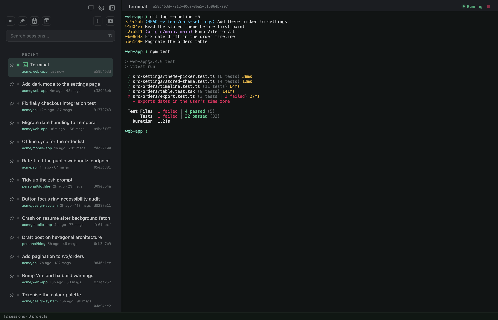
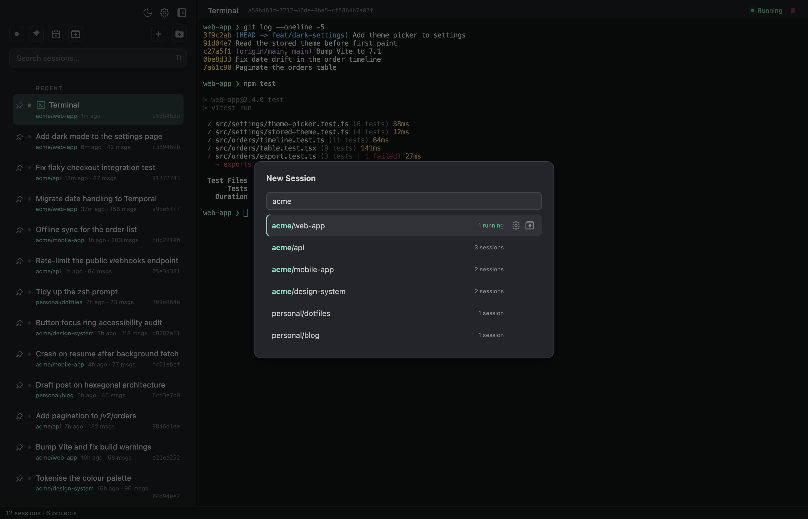
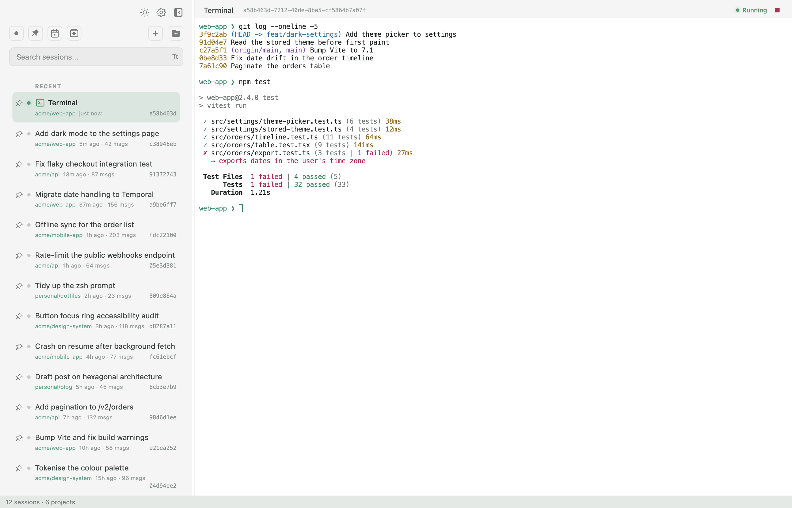

# Switchboard

Your command center for Claude Code sessions.

> **This is a fork.** It started from [doctly/switchboard](https://github.com/doctly/switchboard)
> and has since gone its own way: some features were added, several were removed, and the
> code underneath has been rebuilt. If you are looking for the original, head there.

Switchboard is a desktop app that gives you one view of all your Claude Code sessions across every project. Launch, resume and monitor sessions from a single window — no more juggling terminal tabs or digging through `~/.claude/projects` to find that one conversation from last week.



## Features

- **Session list** — Every session from every project in one flat list, ordered by recent activity, with running sessions on top
- **Built-in terminal** — Connect to running sessions or start new ones (Claude or a plain shell) without leaving the app
- **Project picker** — Start a session anywhere by fuzzy-filtering your projects, entirely from the keyboard: `+`, type, `↓`, `Enter`
- **Remote projects** — Run sessions on another machine over SSH, kept alive in tmux, with automatic reconnects and a status card while the link is down
- **Status at a glance** — See which sessions are working, waiting for input or blocked on a permission prompt
- **Full-text search** — Find a session by what was discussed, not just when
- **Light and dark** — Follows your system, or pin it to light or dark from the sidebar
- **Usage gauges** — Your Claude plan's limit windows at the bottom of the sidebar
- **Session names** — Picks up names from Claude Code's `/rename` automatically



## What's different in this fork

**Added**

- A light mode with a system / light / dark toggle. The Switchboard and Ghostty terminal themes follow it with light versions of their own; the Ghostty one keeps its softer contrast, with charcoal text on white
- SSH remote projects with persistent tmux sessions, reconnection, and a live view of what the connection is doing
- A flat, recency-ordered session list with a fuzzy project picker you can drive from the keyboard
- Terminal font family, size and line height settings, applied live to open sessions
- A frameless window, with the app's own headers where the title bar used to be
- A palette based on Slack's dark workspace theme, built on colour tokens
- Archiving a session also stops it

**Removed**

- The session grid, IDE emulation and its diff side panel, and the Plans, Agent Files and Stats tabs
- Fork, mark-as-unread and the message-history viewer
- The scheduled task button

**Under the hood**

- Rewritten in strict TypeScript and SCSS, with CI running the test suite
- Restructured into a hexagonal (ports and adapters) architecture — see [ARCHITECTURE.md](ARCHITECTURE.md)



## Keyboard

| Shortcut | Action |
|----------|--------|
| `Cmd+F` / `Ctrl+F` | Find in the terminal |
| `Cmd+Shift+[` / `]` | Previous / next session |
| `Cmd+←` `↑` / `Cmd+→` `↓` | Previous / next session |

## Thanks

Switchboard was created by [Doctly](https://github.com/doctly) — thank you to Ali Basiri and
everyone who contributed to [the original](https://github.com/doctly/switchboard), which this
fork stands on. The flat session list and project picker are adapted from
[Niek Haarman's fork](https://github.com/nhaarman/switchboard).

## Download

This fork doesn't publish builds; build it from source with the steps below. Prebuilt
releases of the original are on [doctly/switchboard](https://github.com/doctly/switchboard/releases/latest).

## Prerequisites

- **Node.js** 20+
- **npm** 10+
- Xcode Command Line Tools for the native modules (`xcode-select --install`)

## Development Setup

```bash
# Install dependencies (runs postinstall automatically)
npm install

# Start the app
npm start
```

`npm start` bundles CodeMirror and launches Electron. For faster iteration after the first run:

```bash
npm run electron
```

## Building

All build commands bundle CodeMirror first, then invoke electron-builder.

```bash
npm run build:mac     # DMG + zip (arm64 + x64)
```

Output goes to `dist/`.

## Releasing

Releases are driven by git tags:

```bash
git tag v0.1.0
git push origin v0.1.0
```

The GitHub Actions workflow builds the macOS app and publishes to GitHub Releases. You can also release locally:

```bash
npm run release   # builds + publishes to GitHub Releases
```

Set `GH_TOKEN` in your environment (a GitHub personal access token with `repo` scope).

## Code Signing

For distribution, set these environment variables:

- `CSC_LINK` (p12 certificate) and `CSC_KEY_PASSWORD`, or sign via Keychain
- Set `CSC_IDENTITY_AUTO_DISCOVERY=false` to skip signing (CI artifact builds)

The macOS build uses custom entitlements (`build/entitlements.mac.plist`) to allow JIT and unsigned memory execution, required by native modules (node-pty, better-sqlite3).

## Project Structure

Switchboard is arranged as a hexagon — rules in the middle, the world at the
edges, interfaces between them. See [ARCHITECTURE.md](ARCHITECTURE.md) for what
lives where and how to add to it.

```
src/domain/          The rules. Pure TypeScript: no node, no Electron, no DOM,
                     shared by both processes
src/application/     Use cases, written against port interfaces
src/application/ports/   The interfaces (repository, terminal, filesystem, …)
src/infrastructure/  The adapters: sqlite, node-pty, fs, ssh, mcp, electron
src/ipc/             The process boundary — channel names and the API contract
src/main/            Composition root + IPC handler registration + bootstrap
src/preload/         Context bridge; implements the IPC contract
src/renderer/        The UI: app/ (bootstrap, routing), state/, features/, lib/
src/renderer/styles/ SCSS partials, one per UI area
src/workers/         Worker threads (the cold-start project scanner)
app/                 Build output (gitignored) — what Electron actually runs
test/                Node test-runner suites, run through tsx
scripts/             Build (esbuild + sass), icon and postinstall scripts
build/               Icons, entitlements, builder resources
.github/workflows/   CI/CD
```

The app is written in TypeScript (strict) and SCSS. `npm run build` compiles
everything into `app/` with esbuild and sass; `npm run typecheck` runs `tsc`
over the whole tree; `npm test` builds and then runs the suites. Node 20 or
newer is required — TypeScript 7 will not load on 18.
